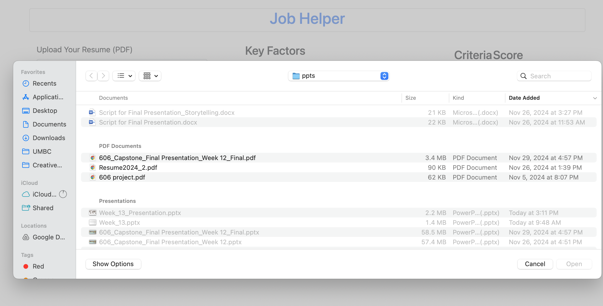
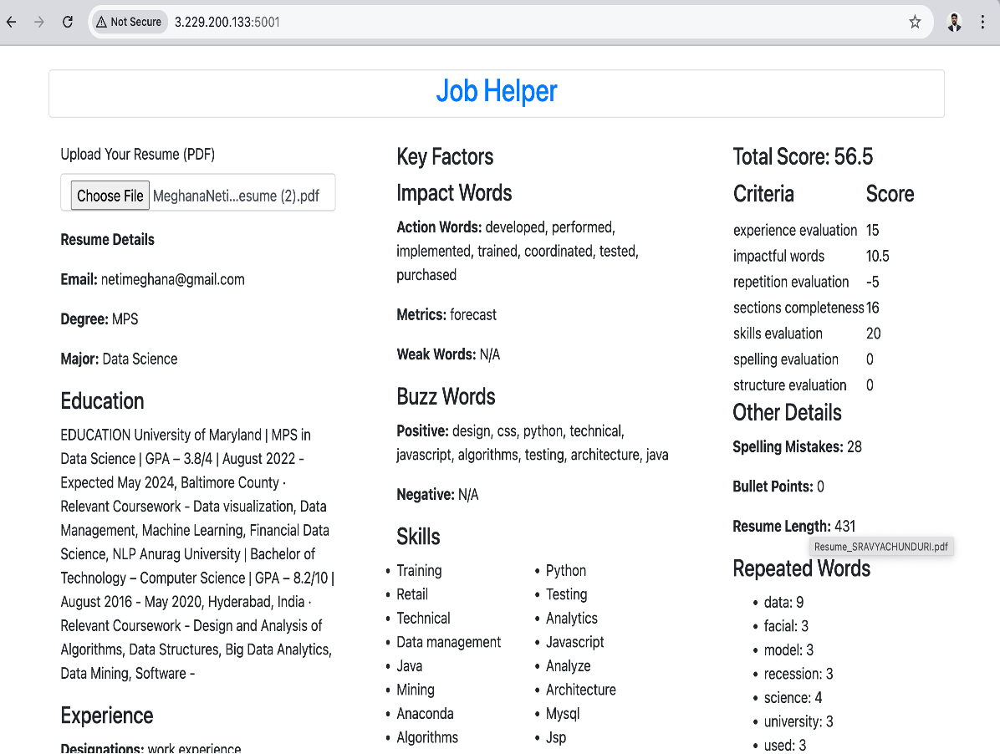
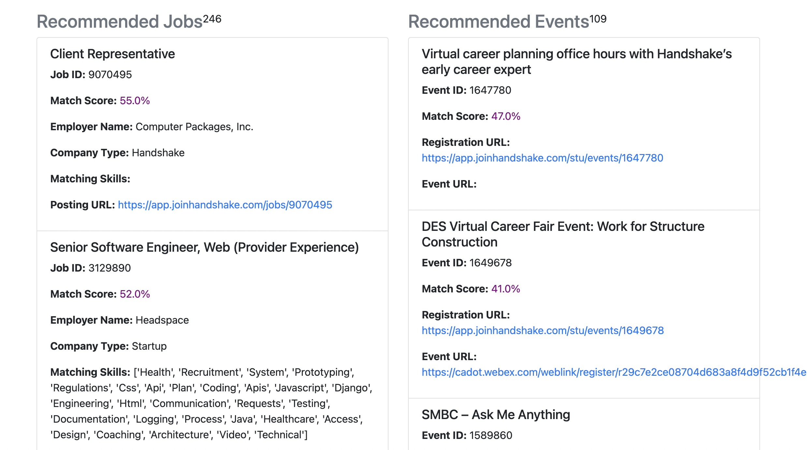

# **JobHelper: Intelligent Resume Analysis and Job Recommendations**

JobHelper is a robust, Flask-based web application designed to streamline job searches, improve resumes, and recommend networking events. The project uses cutting-edge natural language processing (NLP) techniques and machine learning models to analyze resumes, recommend jobs, and provide actionable feedback.

---

## 📜 **Table of Contents**

1. [Problem Statement](#-problem-statement)  
2. [Features](#-features)  
3. [Project Architecture](#-project-architecture)  
4. [Setup and Installation](#%EF%B8%8F-setup-and-installation)  
5. [Usage Instructions](#%EF%B8%8F-usage-instructions)  
6. [Screenshots](#%EF%B8%8F-screenshots)  
7. [Future Directions](#-future-directions)  
8. [License](#-license)  

---

## 🔍 **Problem Statement**

The growing volume of resumes and job listings makes it challenging for job seekers to tailor resumes effectively and find suitable opportunities. Manual evaluation is time-consuming and error-prone. This project addresses these challenges by providing:  
- **Automated Resume Scoring**  
- **Job and Event Recommendations** using NLP and Semantic Similarity  
- **A User-Friendly Interface** for seamless interaction  

---

## 🌟 **Features**

### **Resume Analysis**
- **Resume Scoring**: Evaluates resumes based on structure, spelling, impactful words, and more.  
- **Feedback**: Provides actionable suggestions to enhance resumes.  

### **Job and Event Recommendations**
- **Job Recommendations**: Uses sentence-transformer models to calculate cosine similarity between resumes and job listings.  
- **Event Recommendations**: Matches user profiles with networking events tailored to career interests.  

### **Interactive UI**
- File upload functionality for resume analysis.  
- Dynamic tables for sorting and filtering job and event recommendations.  
- Match scores displayed for better visualization of relevance.  

---

## 🏗️ **Project Architecture**

### **Backend**
- **Framework**: Flask  
- **Gunicorn**: Handles HTTP requests  
- **Python Libraries**: SpaCy, NLTK, Sentence-Transformers, Selenium, Pandas  

### **Frontend**
- **HTML/CSS**: With Bootstrap for responsive design  
- **JavaScript**: For dynamic interactivity  

### **Data**
- Scraped job listings and events stored as CSV files.
- Portal - https://app.joinhandshake.com/explore
- Portal - https://wellfound.com/
- 
- NLP preprocessing using SpaCy and regex for parsing resumes.  

### **Deployment**
- **Hosted on**: Amazon Lightsail  
- **Systemd Service**: Ensures the app restarts on instance reboot.  

---

## ⚙️ **Setup and Installation**

### **Prerequisites**
- Python 3.8+  
- Google Chrome and Chromedriver for Selenium  
- An active Amazon Lightsail instance  

### **Installation**

1. **Clone the repository**:
   ```bash
   git clone https://github.com/karthikvibuthi/finalproject.git
   cd JobHelper

## **Set up the Virtual Environment**

1. **Create and activate a virtual environment**:
   ```bash
   python3 -m venv venv
   source venv/bin/activate
   pip install -r requirements.txt

# Set up logging and ensure all directories are accessible:

```bash
mkdir logs
```

## Update scraping scripts:

Ensure your job and event scraping scripts are scheduled using a systemd service. Follow this guide for details.

## Start the application:

```bash
gunicorn -w 4 app:app
```

## 🛠️ Usage Instructions on Cloud Instance
Access the application at [http://3.229.200.133:5001](http://3.229.200.133:5001) in your browser.
Upload a resume in PDF format for analysis.

### View:
- Resume Score with detailed breakdown
- Personalized Job Recommendations
- Tailored Event Suggestions

## 🖼️ Screenshots

### Comparison with other platforms
![alt text] (


### Upload Resume


### Resume Score

### Job Recommendations

## 🔮 Future Directions
### Enhanced Storage:
- Transition from CSV files to MongoDB for scalability.
- Integrate data pipelines for real-time updates.

### API Integration:
- Use the Handshake API for dynamic job and event data.

### Advanced NLP:
- Leverage fine-tuned BERT models for improved resume parsing and matching.

### Mobile App:

- Develop and launch a mobile application for on-the-go access.
